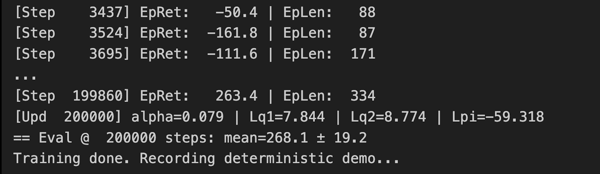

# Soft Actor-Critic (SAC) — LunarLanderContinuous-v3 (PyTorch from Scratch)

This repository contains a from-scratch implementation of the **Soft Actor-Critic (SAC)** algorithm in PyTorch.  
SAC is an off-policy actor-critic method that maximizes expected return **while also maximizing entropy**, encouraging more exploratory and robust policies.

---

## Key Features
- Fully implemented from scratch in PyTorch  
- **Entropy-regularized objective** for stable exploration  
- **Twin Q-networks** to reduce overestimation bias  
- **Target value smoothing** for stability  
- **Replay Buffer** for efficient experience reuse  
- Modular implementation with training, evaluation, and recording scripts  

---

## Training Results
The agent is trained on **LunarLanderContinuous-v3** (Gymnasium), achieving stable learning and smooth landings.  

📈 **Reward Curve:**  


🎥 **Demo Video:**  
[sac_lander_demo-episode-0.mp4](./sac_lander_demo-episode-0.mp4)

---

## File Structure
- `SAC.ipynb` — Jupyter/Colab notebook for experiments  
- `sac-skeleton.py` — Core SAC agent (actor, twin critics, entropy tuning)  
- `train-record-setup.py` — Training and logging setup  
- `eval.py` — Evaluation of trained agent  
- `record-demo.py` — Script to generate MP4 demo  
- `networks.py` — Actor and critic neural networks  
- `replaybuffer.py` — Replay buffer implementation  
- `utils.py` — Helper functions  
- `reward-result.png` — Training reward curve  
- `sac_lander_demo-episode-0.mp4` — Demo video of trained agent  

---

## Quickstart
```bash
# Clone repository
git clone https://github.com/DHAANUS/SAC-LunarLander-from-scratch.git
cd SAC-LunarLander-from-scratch

# Install dependencies
pip install torch gymnasium[box2d] imageio opencv-python

# Train the agent
python train-record-setup.py

# Evaluate and record demo
python record-demo.py
